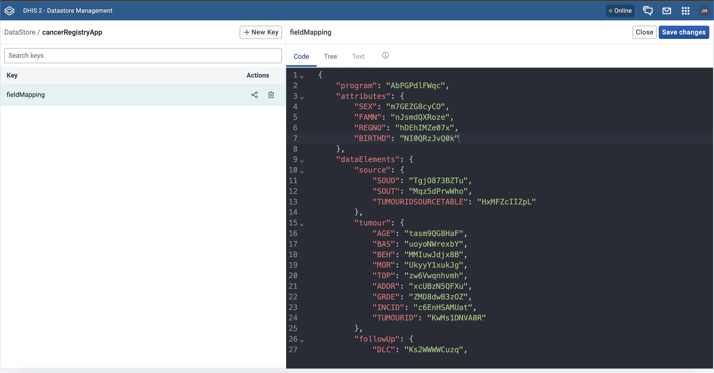

# Cancer Registry DHIS2 App

A DHIS2 web application that exports patient, tumour, and source data from a [DHIS2 Cancer Registry Tracker program](https://docs.dhis2.org/en/implement/health/non-communicable-diseases/cancer-registry/overview.html) into CanReg5-compatible TSV files. Built with the [DHIS2 Application Platform](https://github.com/dhis2/app-platform).

This app was originally developed by [HISP Rwanda](https://hisprwanda.org) to fit the Rwanda cancer registry use-case. The core [DHIS2](https://dhis2.org) team has since reworked the app to make the mapping customizable, so it can be reused by any country or implementation without changes to the app code.

## How it works

The app has four export tabs: Patient, Tumour, Source, and All Records, each producing a `.tsv` file that can be imported into CanReg5.

Which fields end up as columns in the export is  controlled by a mapping table stored in the [DHIS2 data store](https://docs.dhis2.org/en/develop/using-the-api/dhis-core-version-master/data-store.html) (namespace `cancerRegistryApp`, key `fieldMapping`). Each key in the mapping corresponds to a CanReg5 variable name (= column in the export), and the value is the DHIS2 attribute or data element UID.

On first launch the app seeds the DataStore with a default mapping (see [defaultMapping](/src/mapping/defaultMapping.js)). After that, changes are made directly in the data store, which means that no code changes are needed.

## Configuration

### Mapping structure

The app expects a tracker program that follows the cancer registry metadata structure: a program with source, tumour, and follow-up stages, along with a set of tracked entity attributes for patient-level data. The mapping ties each of these to their DHIS2 UIDs.

The app comes preconfigured with the mapping for the [DHIS2 Cancer Registry Toolkit](https://docs.dhis2.org/en/implement/health/non-communicable-diseases/cancer-registry/overview.html) metadata package. If your instance uses this package, the default mapping should work out of the box. For custom setups, update the UIDs accordingly.

### How to add or change fields


1. Open the DataStore Manager app in your DHIS2 instance.
2. Navigate to `cancerRegistryApp` and `fieldMapping`.
3. Add, remove, or update entries in the JSON.
4. Save. The app picks up changes on the next page load.

### Example: adding a phone number to the patient export

Say you have configured a tracked entity attribute in DHIS2 for the patient's phone number. To include it in the CanReg5 export, add a `PHONE1` entry (corresponding to the canreg5 data element name for phone number) to the `attributes` section of the mapping:

```diff
 "attributes": {
     "REGNO":   "hDEhIMZe07x",
     "SEX":     "m7GEZG8cyCO",
     "BIRTHD":  "NI0QRzJvQ0k",
     "FAMN": "nJsmdQXRoze",
+    "PHONE1":  "<UID_PHONE_ATTRIBUTE>"
 }
```

After saving, the patient export will include a `PHONE1` column with the corresponding attribute value. The same approach works for the `dataElements` sections: Add a key/value pair under `source`, `tumour`, or `followUp` to include additional data element columns.

> The mapping keys must match valid CanReg5 variable names, and the UIDs must point to existing DHIS2 metadata.

## Derived columns

The app also generates a few derived columns at export time. These are not part of the mapping, they are computed automatically.

| Column | Export | Description |
|--------|--------|-------------|
| `PATIENTRECORDID` | Patient, All Records | `REGNO` + `"01"`, the patient record identifier expected by CanReg5 |
| `PATIENTUPDATEDBY` | Patient, All Records | DHIS2 username that last updated the patient record |
| `TUMOURUPDATEDBY` | Tumour, All Records | DHIS2 username that last updated the tumour event |
| `SOURCERECORDID` | Source, All Records | `TUMOURIDSOURCETABLE` + two-digit source index (`01`, `02`, …) |

## Running the application

This application can be installed on any DHIS2 instance that has the DHIS2 cancer registry program configured.

In the project directory, you can run:

### `yarn start`

Runs the app in the development mode.<br />
Open [http://localhost:3000](http://localhost:3000) to view it in the browser.

The page will reload if you make edits.<br />
You will also see any lint errors in the console.

### `yarn test`

Launches the test runner and runs all available tests found in `/src`.<br />

See the section about [running tests](https://platform.dhis2.nu/#/scripts/test) for more information.

### `yarn build`

Builds the app for production to the `build` folder.<br />
It correctly bundles React in production mode and optimizes the build for the best performance.

The build is minified and the filenames include the hashes.<br />
A deployable `.zip` file can be found in `build/bundle`!

See the section about [building](https://platform.dhis2.nu/#/scripts/build) for more information.

### `yarn deploy`

Deploys the built app in the `build` folder to a running DHIS2 instance.<br />
This command will prompt you to enter a server URL as well as the username and password of a DHIS2 user with the App Management authority.<br/>
You must run `yarn build` before running `yarn deploy`.<br />

See the section about [deploying](https://platform.dhis2.nu/#/scripts/deploy) for more information.

## Learn more

You can learn more about the platform in the [DHIS2 Application Platform Documentation](https://platform.dhis2.nu/).

You can learn more about the runtime in the [DHIS2 Application Runtime Documentation](https://runtime.dhis2.nu/).

To learn React, check out the [React documentation](https://reactjs.org/).

## Credits

Originally developed by [HISP Rwanda](https://hisprwanda.org). Configuration externalized by the [DHIS2](https://dhis2.org) core team.

| Name | Role | Contact |
|------|------|---------|
| Maurice Jules Mulisa | Developer (HISP Rwanda) | [mauricejulesm](https://github.com/mauricejulesm) |
| Pascal Ndayizigiye | Developer (HISP Rwanda) | pndayizigiye@hisprwanda.org |
| Johan Hole | Developer (DHIS2 Extensibility Team) | [johanghole](https://github.com/johanghole) |
